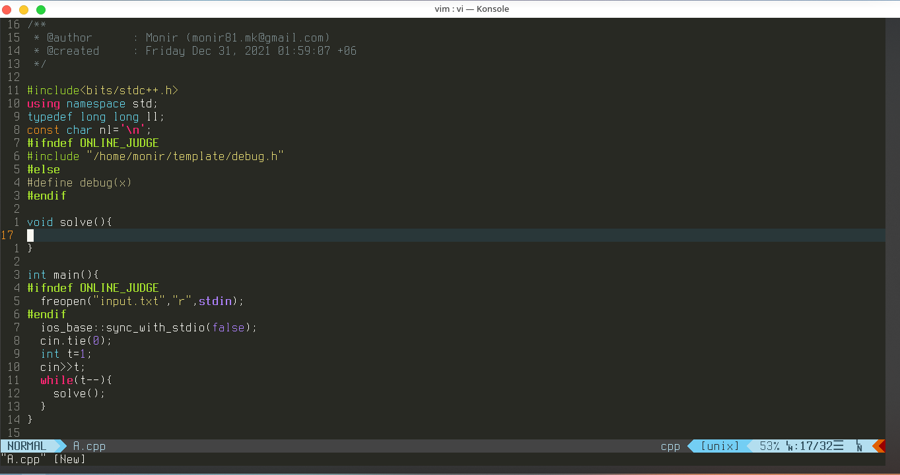

# Vim for Compettitive Programmers (Best Configuration)

`Hello Vim Lovers`

## Vim Setup in Linux
### Installation
#### Vim
Vim usually pre-installed in all kind of Linux distribution.But make sure that you have latest Vi-Improved installed. If not then you can install with the following commands.
##### Ubuntu/Debian Based
    apt-get install vim
##### Arch Based
    pacman -S vim
#### Xterm ( For running compiler )
##### Ubuntu/Debian Based
    apt-get install xterm
##### Arch Based
    pacman -S xterm
### IDE Setup
#### Set up [Vundle]:
    git clone https://github.com/VundleVim/Vundle.vim.git ~/.vim/bundle/Vundle.vim
#### Vimrc 
Copy the vimrc file to the root directory rename the file to .vimrc. Change vimrc according to your need.
#### Install Plugins
 Launch `vim` and run `:PluginInstall`
#### Colors
 Copy colors folder to .vim folder. This folder is hidden in linux root directory. So you have to show all hidden files from the file manager and the paste the file to .vim folder.
 ### C++ Setup
 #### Compiler
 For compiling c++ vim we are using codeblocks console runner software. Just copy cb_console_runner to `/usr/bin/` folder and now its all set up. Now you can press `F9` to compile c++ files.  
 
 ### Screenshot
 
 
 ### Note
 Change vimrc Key mappings according to your need. I think you will find it great. Happy coding.
